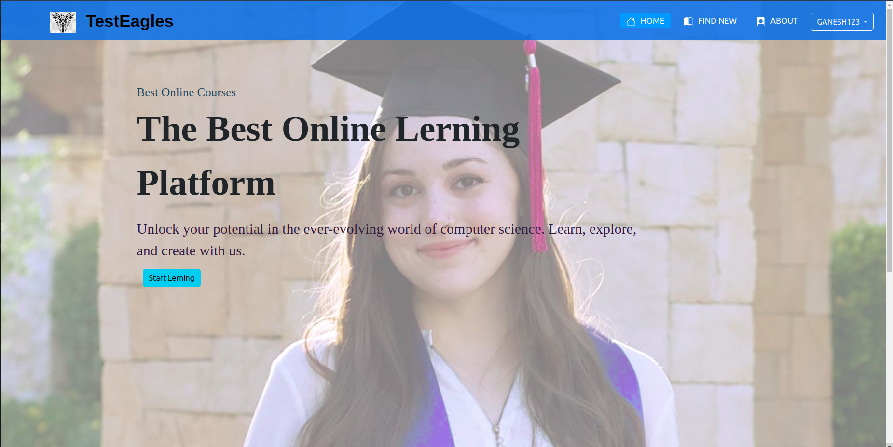
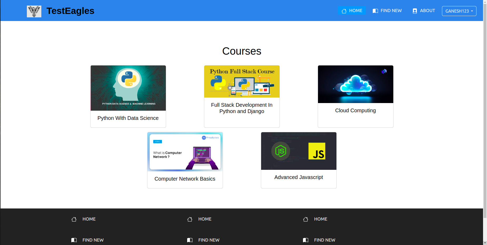
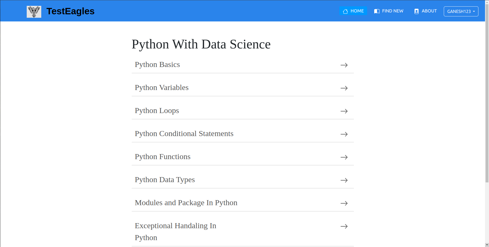
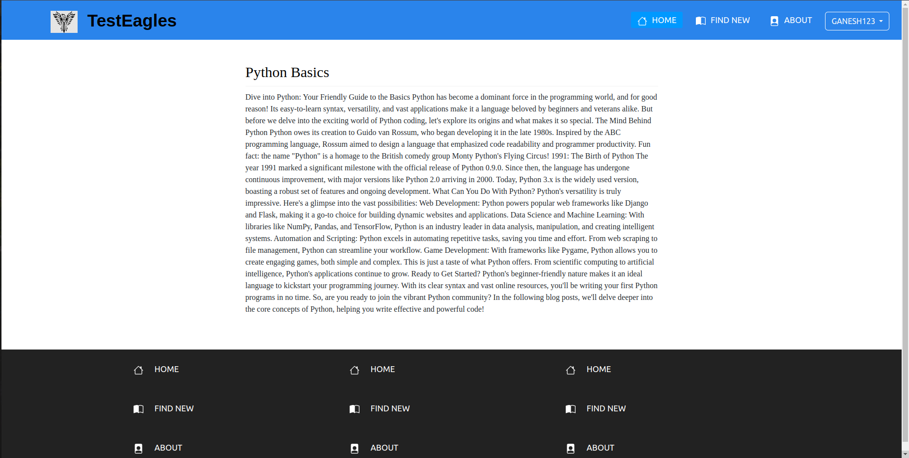

# TestEagles

Welcome to the TestEagles eLearning Platform repository! 
This project aims to provide a comprehensive online learning experience with various features and a user-friendly interface.

## Features

- **Created User Authentication**
  - Secure and reliable user authentication system.
- **Admin Panel**
  - Manage courses, users, and other administrative tasks.
- **Best UI**
  - Intuitive and aesthetically pleasing user interface.
- **User Profile**
  - Personalized user profiles with progress tracking and customization options.

## Screenshots

### Home Page

### Courses Page

### Course Chapters Page

### Lesson Page

## Getting Started

To get a local copy up and running follow these simple steps.

### Prerequisites

- Python 3.8.10
- Django 4.2.13
- Virtualenv

